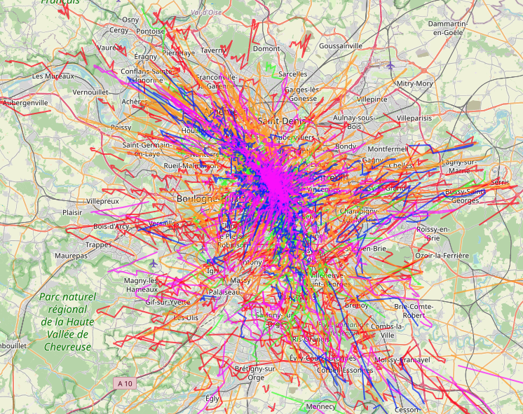

# ml_mobility_ns3

Trajectory generation models for mobility simulation.

## Installation

```bash
poetry install
```

## Part 1: Preprocess, Train, Evaluate Trajectory Generation

### Data Preprocessing
# first dowload and unzip the netmob25 into data/netmob25
```bash
poetry run python scripts/preprocess.py data.data_dir=data/netmob25
```

### Training

```bash
poetry run python scripts/train.py model=vae_lstm training.epochs=100
```

### List Experiments
```bash
poetry run python scripts/list_experiments.py
```

### Evaluation

```bash
poetry run python scripts/evaluate.py +experiment_id=optimal_medium_v2
```

### Generated Trajectories Example



*Example of generated trajectories showing the model's capability to produce realistic mobility patterns.*

### Configuration

All configurations are managed through Hydra. Default configs are in `configs/`.

### Model Selection

```bash
poetry run python scripts/train.py model=dummy training.epochs=3 accelerator=cpu # Use dummy model
poetry run python scripts/train.py model=vae_lstm  accelerator=gpu devices=[3] device=cuda # Use VAE-LSTM model

poetry run python scripts/train.py --config-path=configs/sweep --config-name=basic_grid --multirun
```

### Hyperparameter Tuning

```bash
poetry run python scripts/train.py model.hidden_dim=128 training.learning_rate=1e-3
```

## Part 2: Use Trajectory Generation Model in NS-3

### NS-3 Integration

#### Prerequisites

1. **Install NS-3:**
```bash
wget https://www.nsnam.org/releases/ns-3.45.tar.bz2
tar -jxvf ns-3.45.tar.bz2
cd ns-3.45
./ns3 configure --enable-examples --enable-tests
./ns3 build
```

2. **Download and Install LibTorch in NS-3 directory:**
```bash
cd ns-3.45
# Download libTorch C++ (LibTorch) - CPU version (https://pytorch.org/get-started/locally/)
# For linux : 
wget https://download.pytorch.org/libtorch/cpu/libtorch-shared-with-deps-2.8.0%2Bcpu.zip
unzip libtorch-shared-with-deps-2.8.0%2Bcpu.zip
# For mac :
wget https://download.pytorch.org/libtorch/cpu/libtorch-macos-arm64-2.8.0.zip
unzip libtorch-macos-arm64-2.8.0.zip

export TORCH_ROOT=$(pwd)/libtorch
export CMAKE_PREFIX_PATH=$TORCH_ROOT:$CMAKE_PREFIX_PATH
```

#### Export and Integration

```bash
# 1. Export your trained model
poetry run python scripts/export.py +experiment_id=optimal_medium_v2
```

This creates `cpp_ns3_export/optimal_medium_v2/` containing:
- `netmob25-mobility-model.h` - NS-3 mobility model header with integrated LibTorch support
- `netmob25-mobility-model.cc` - NS-3 mobility model implementation with ML generation
- `netmob25-mobility-example.cc` - Complete simulation example
- `netmob25-mobility-example-v2.cc` - LTE network example with automatic base station placement
- `CMakeLists.txt` - CMake configuration for NS-3 mobility module with LibTorch support
- `model.pt` - TorchScript model for inference
- `metadata.json` - Model metadata
- `scalers.json` - Coordinate transformation parameters

```bash
# 2. Copy files to NS-3
cd cpp_ns3_export/optimal_medium_v2
cp netmob25-mobility-model.* ../../ns-3.45/src/mobility/model/
cp netmob25-mobility-example.cc ../../ns-3.45/scratch/
cp netmob25-mobility-example-v2.cc ../../ns-3.45/scratch/
cp model.pt ../../ns-3.45/
cp CMakeLists.txt ../../ns-3.45/src/mobility/

# 3. Build NS-3 with LibTorch support
cd ns-3.45
export TORCH_ROOT=$(pwd)/libtorch
CMAKE_PREFIX_PATH=$TORCH_ROOT ./ns3 configure --enable-examples
CMAKE_PREFIX_PATH=$TORCH_ROOT ./ns3 build

# 4. Run the example with ML trajectory generation
./ns3 run "scratch/netmob25-mobility-example --nNodes=1 --simTime=100"

# 5. Run the LTE network example with base station placement
# This example captures the min/max x,y positions from user trajectories
# and places an eNodeB (base station) at the center of the mobility area
./ns3 run "scratch/netmob25-mobility-example-v2 --nNodes=3 --simTime=100"
```